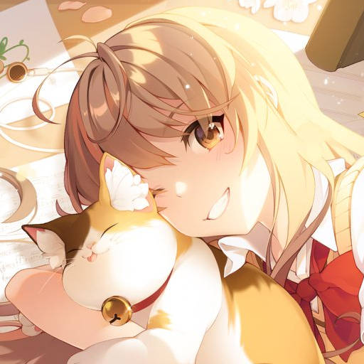
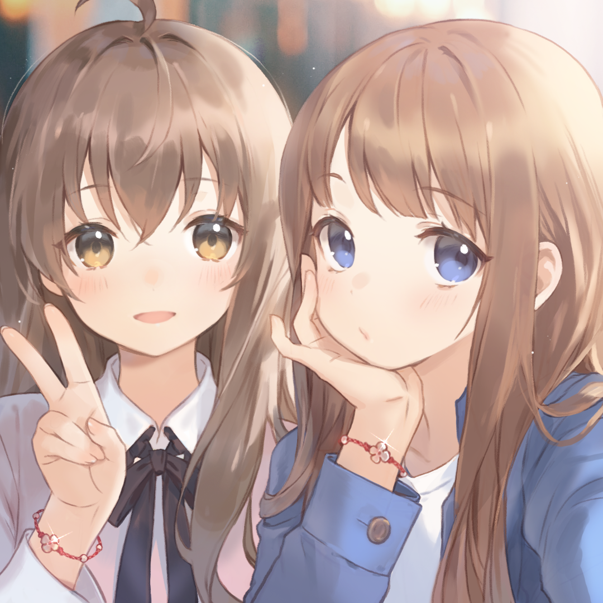

<!-- Header -->

  
  

<!-- Social Media -->

  
  

<!-- About Me -->

### 🌸 About Me:

  

-   🌱 Currently learning `Web Development`
-   🎮 `Music`, `Games`, and `Anime` are my escapes!
-   🌟 Favorite anime: `Fruits Basket` and `Yuru Camp`
-   🕒 **Status**: `It would take some times for me to reply`
-   💻 BTW, I use `Arch!` 🚀

  

  

    
  

<!-- Tools and Languages -->

### 🚀 Tools & Languages:

  

<!-- Anime Photo Album -->

### 🎬 Photo Album:

  
  
  

<!-- Quotes -->

### ✨ Quotes:

> _"I want to make people happy with my code. Although I'm shy and unsure of myself, I'll do my best to fulfill this dream!"_

